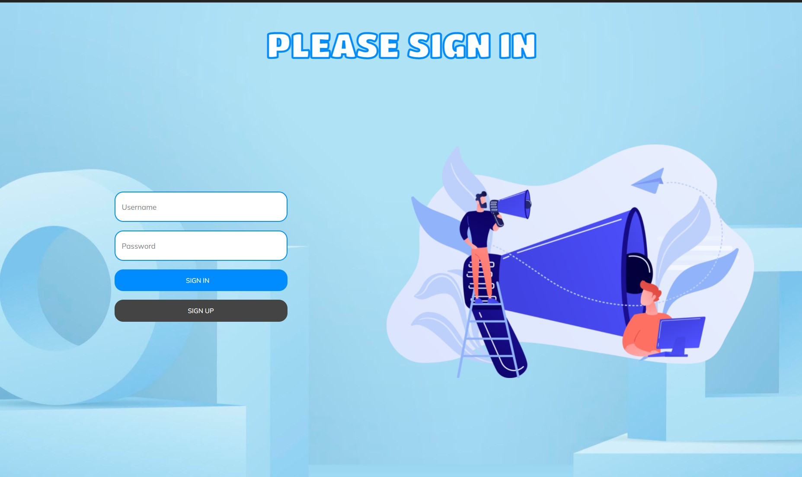

## Проект в рамках обучения "Spring framework"

### Цель: создать приложение с современным дизайном и функционалом приближенным к twitter.

| Что необходимо сделать       |    Сделана ❌☑️  |
| :---        |    :----:    |
|Форма логина и регистрации|☑️ |  
|Отображение сообщений из БД|☑️|
|Валидация данных|☑️|
|Панель админа| ☑️|
|Редактирование пользователей| ☑️|
|Добавление картинок к постам| ☑️|
|Удаление постов и картинок из репо|☑️|
|Профиль пользователя с добавлением аватарок (добавить загрузку картинок)|☑️|
|Футер|☑️|
|Миграция на AWS S3|☑️|
|Деплой на хероку|☑️|
|Дизайн страницы редактирования админа|❌|
|Панель навигации|❌|
|Оптимизировать загрузку изображений пользователя и удаление изображений|❌|

## Скриншоты дизайна основных страниц
## ***!Дизайн неокончателен и будет меняться!***

### Приветственная страница

### Страница логина

### Основная страницы

### Профиль пользователя

