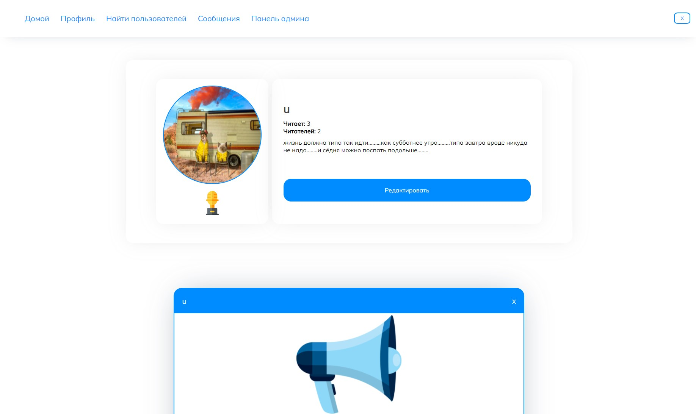

## Проект в рамках обучения "Spring framework" 

***
Проект завершен :)
***

### Цель: создать приложение с современным дизайном и функционалом приближенным к twitter.

| Основные фичи 
| :---      |
|Посты с возможностью добавлять фотографии|
|Фильтрация постов по тегу|
|Комментарии и лайки к постам|
|Система подписок на пользователей|
|Система чатов (Писать можно только пользователям из подписок)|
|Система наград за активность (публикация, лайки и подписки|
|Связка с AWS S3 для хранения картинок|
|Набор стоковых фотографий под аватарки (выдается новым пользователям рандомно)|

## Скриншоты основных страниц

### Приветственная страница

### Страница логина

### Основная страницы

### Профиль пользователя

### Страница чата

